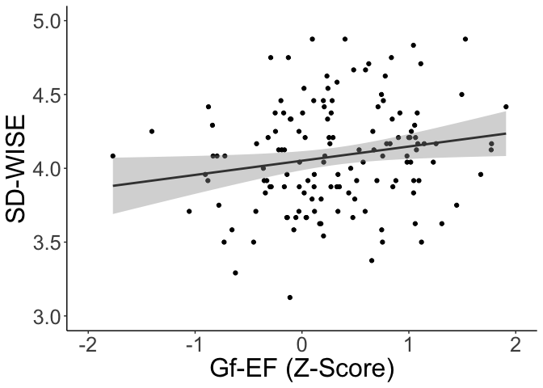
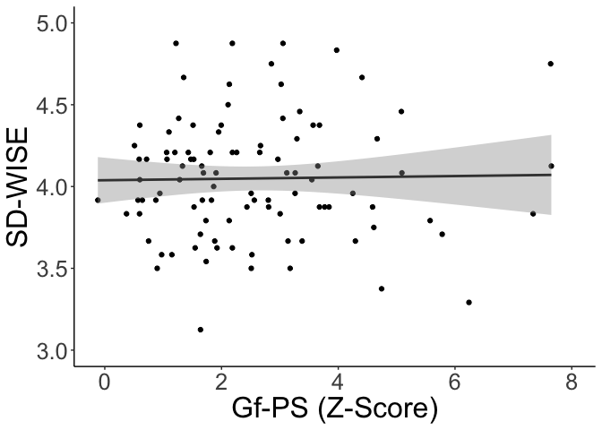
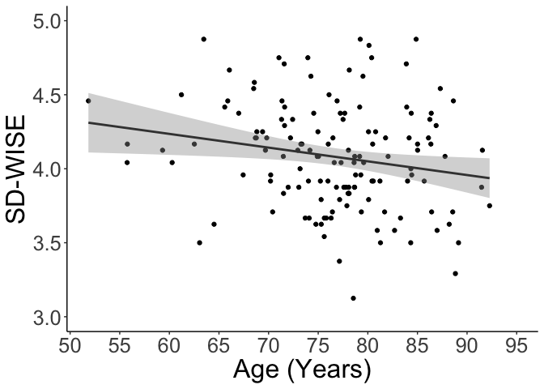

SDWISE plots
Clayton Young
6/17/2020

Load up the librarys we’ll be using: tidyverse, haven, (probably more as
this continues…)

``` r
library(knitr)
library(tidyverse)
library(haven)
```

Set up directories to repofolder and datafolder:

``` r
# setup datafolder target
if (Sys.info()["sysname"] == "Windows") {
    repofolder <- paste("C:/Users/", Sys.getenv("USERNAME"), "/decisionlab/AgingCog/analysis/Wisdom",
        sep = "")
    datafolder <- "R:/groups/chiong/aging-and-cognition/tasks/Wisdom/"
    rdrivepath <- "R:/"
} else if (Sys.info()["sysname"] == "Darwin") {
    # not sure why MacOS is 'Darwin' but it is...
    repofolder <- "~/decisionlab/AgingCog/analysis/Wisdom"
    datafolder <- "/Volumes/macdata/groups/chiong/aging-and-cognition/tasks/Wisdom/"
    rdrivepath <- "/Volumes/macdata/"
}  # probably good to add another condition for Unix, later on...

knitr::opts_chunk$set(echo = TRUE)
knitr::opts_knit$set(root.dir = datafolder)
# comment out (see root.dir above): setwd(datafolder)
```

## Import Wisdom csv and save custom palette

``` r
wisdom_df <- read.csv(paste(datafolder, "wisdom_df.csv", sep = ""))
cbPalette <- c("#f7fcf0", "#ccebc5", "#a8ddb5", "#7bccc4", "#4eb3d3", "#2b8cbe",
    "#0868ac", "#084081")
# We may not be able to use this palette if our data are not continuous...
```

## LM Executive predictor

``` r
model_wisdomExecutive<-lm(Score_MEAN ~ bsexzscore, data = wisdom_df)
summary(model_wisdomExecutive)
```

    ## 
    ## Call:
    ## lm(formula = Score_MEAN ~ bsexzscore, data = wisdom_df)
    ## 
    ## Residuals:
    ##     Min      1Q  Median      3Q     Max 
    ## -3.9770 -0.2325  0.0149  0.2583  0.9072 
    ## 
    ## Coefficients:
    ##             Estimate Std. Error t value Pr(>|t|)    
    ## (Intercept)  3.95834    0.03612 109.575   <2e-16 ***
    ## bsexzscore   0.09729    0.05310   1.832   0.0682 .  
    ## ---
    ## Signif. codes:  0 '***' 0.001 '**' 0.01 '*' 0.05 '.' 0.1 ' ' 1
    ## 
    ## Residual standard error: 0.5151 on 229 degrees of freedom
    ##   (2 observations deleted due to missingness)
    ## Multiple R-squared:  0.01444,    Adjusted R-squared:  0.01014 
    ## F-statistic: 3.356 on 1 and 229 DF,  p-value: 0.06825

## 1\) Wisdom and Executive Functioninging (with EF on the x-axis)

The filter for Graph \#1 is (N = 141): SD\_WISE\_Filter = 1 AND CDRTot =
0 AND DifferenceSDWise\_CDR \<= 730 AND DifferenceSDWise\_BedsideExec
\<= 730

``` r
wisdom_df%>%
  filter(SD_WISE_Filter == 1 & CDRTot == 0 & DifferenceSDWise_CDR <= 730 &
           DifferenceSDWise_BedsideExec <= 730)%>%
  ggplot(aes(y=Score_MEAN, x = bsexzscore))+
  #theme_classic get rid of background grid
  #theme_light()+
  theme_classic()+
  theme(panel.border = element_blank()) + 
  theme(axis.line = element_line())+
  theme(text = element_text(size=24))+
  geom_point()+
  geom_smooth(method = "lm", se = TRUE, color = "grey25", formula = y~x)+
  #scale_colour_gradient(name = "Age", low = "#7bccc4", high = "#084081")+
  #don't need color gradient for age
  ylab("SD-WISE")+
  xlab("Gf-EF (Z-Score)")+
  ylim(3,5)+
  expand_limits(x = c(-2, 2))
```

<!-- -->

``` r
  #ggsave("WisdomExecFxn.eps", device=cairo_ps, fallback_resolution = 1200)


plot1_df<-wisdom_df%>%
  filter(SD_WISE_Filter == 1 & CDRTot == 0 & DifferenceSDWise_CDR <= 730 &
           DifferenceSDWise_BedsideExec <= 730)

#plot2_df is df with the filtered conditions: 
#SD_WISE_Filter = 1 AND CDRTot = 0 AND 
#DifferenceSDWise_CDR <= 730 AND 
#DifferenceSDWise_BedsideExec <= 730
```

## LM Spatial predictor

``` r
model_wisdomSpeed<-lm(Score_MEAN ~ spatial, data = wisdom_df)
summary(model_wisdomSpeed)
```

    ## 
    ## Call:
    ## lm(formula = Score_MEAN ~ spatial, data = wisdom_df)
    ## 
    ## Residuals:
    ##     Min      1Q  Median      3Q     Max 
    ## -3.9977 -0.2144  0.0069  0.2661  0.9171 
    ## 
    ## Coefficients:
    ##             Estimate Std. Error t value Pr(>|t|)    
    ## (Intercept)  4.00744    0.07184  55.780   <2e-16 ***
    ## spatial     -0.01621    0.02380  -0.681    0.496    
    ## ---
    ## Signif. codes:  0 '***' 0.001 '**' 0.01 '*' 0.05 '.' 0.1 ' ' 1
    ## 
    ## Residual standard error: 0.5422 on 197 degrees of freedom
    ##   (34 observations deleted due to missingness)
    ## Multiple R-squared:  0.002351,   Adjusted R-squared:  -0.002713 
    ## F-statistic: 0.4643 on 1 and 197 DF,  p-value: 0.4964

## 2\) Wisdom and Processing Speed (with PS on the x-axis)

SD\_WISE\_Filter = 1 AND CDRTot = 0 AND DifferenceSDWise\_CDR \<= 730
AND DifferenceSDWise\_ProcSpeed \<= 730

``` r
wisdom_df%>%
  filter(SD_WISE_Filter == 1 & CDRTot == 0 & DifferenceSDWise_CDR <= 730 &
           DifferenceSDWise_ProcSpeed <= 730 & spatial != "NA")%>%
  ggplot(aes(y=Score_MEAN, x = spatial))+
  #theme_classic gets rid of background grid
  theme_classic()+
  #theme_light()+
  theme(panel.border = element_blank()) + 
  theme(axis.line = element_line())+
  theme(text = element_text(size=24))+
  geom_point()+
  geom_smooth(method = "lm", se = TRUE, color = "grey25", formula = y~x)+
  #scale_colour_gradient(name = "Age", low = "#7bccc4", high = "#084081")+
  #don't need the color gradient for age
  xlab("Processing Speed (Z-Score)")+
  expand_limits(y = c(3, 5))+
  scale_y_continuous(name = "SD-WISE",
                   breaks=seq(from = 3, to = 5, by = .5))+
  expand_limits(x = c(0, 8))+
  scale_x_continuous(name = "Gf-PS (Z-Score)",
                   breaks=seq(from = 0, to = 8, by =2))
```

<!-- -->

``` r
  #ggsave("WisdomProcSpeed.eps", device=cairo_ps, fallback_resolution = 1200)


plot2<-wisdom_df%>%filter(SD_WISE_Filter == 1 & 
                            CDRTot == 0 & DifferenceSDWise_CDR <= 730 &
                            DifferenceSDWise_ProcSpeed <= 730 & spatial != "NA")


#plot2_df is df with the filtered conditions: 
#SD_WISE_Filter = 1 AND CDRTot = 0 AND
#DifferenceSDWise_CDR <= 730 AND
#DifferenceSDWise_ProcSpeed <= 730

#two participants are removed from plot because they contain non-finite numbers
```

## LM Age predictor

``` r
model_wisdomAge<-lm(Score_MEAN ~ Age_precise3, data = wisdom_df)
summary(model_wisdomAge)
```

    ## 
    ## Call:
    ## lm(formula = Score_MEAN ~ Age_precise3, data = wisdom_df)
    ## 
    ## Residuals:
    ##     Min      1Q  Median      3Q     Max 
    ## -3.9765 -0.2308  0.0202  0.2704  0.8996 
    ## 
    ## Coefficients:
    ##               Estimate Std. Error t value Pr(>|t|)    
    ## (Intercept)  3.9516801  0.3072019  12.863   <2e-16 ***
    ## Age_precise3 0.0003737  0.0040589   0.092    0.927    
    ## ---
    ## Signif. codes:  0 '***' 0.001 '**' 0.01 '*' 0.05 '.' 0.1 ' ' 1
    ## 
    ## Residual standard error: 0.5171 on 231 degrees of freedom
    ## Multiple R-squared:  3.67e-05,   Adjusted R-squared:  -0.004292 
    ## F-statistic: 0.008477 on 1 and 231 DF,  p-value: 0.9267

## 3\) Wisdom and Age (with age on the x-axis)

SD\_WISE\_Filter = 1 AND CDRTot = 0 AND DifferenceSDWise\_CDR \<= 730

``` r
wisdom_df%>%
  filter(SD_WISE_Filter == 1 & CDRTot == 0 & DifferenceSDWise_CDR <= 730)%>%
  ggplot(aes(y=Score_MEAN, x = Age_precise3))+
  #theme_classic gets rid of background grid
  #theme_light()+
  theme_classic()+
  theme(panel.border = element_blank()) + 
  theme(axis.line = element_line())+
  theme(text = element_text(size=24))+
  geom_point()+
  geom_smooth(method = "lm", se = TRUE, color = "grey25", formula = y~x)+
  #scale_colour_gradient(name = "Age", low = "#7bccc4", high = "#084081")+
  expand_limits(y = c(3, 5))+
  scale_y_continuous(name = "SD-WISE",
                   breaks=seq(from = 3, to = 5, by = .5))+
  expand_limits(x = c(55, 95))+
  scale_x_continuous(name = "Age (Years)",
                   breaks=seq(from = 50, to = 100, by =5))
```

<!-- -->

``` r
  #ggsave("WisdomAge.eps", device=cairo_ps, fallback_resolution = 1200)


  
  

#plot3_df is df with the filtered conditions: 
#SD_WISE_Filter = 1 AND 
#CDRTot = 0 AND 
#DifferenceSDWise_CDR <= 730

plot3_df<-wisdom_df%>%
  filter(SD_WISE_Filter == 1 & 
  CDRTot == 0 & DifferenceSDWise_CDR <= 730)
```
