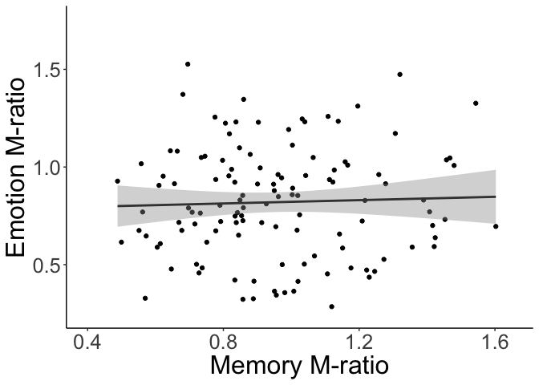
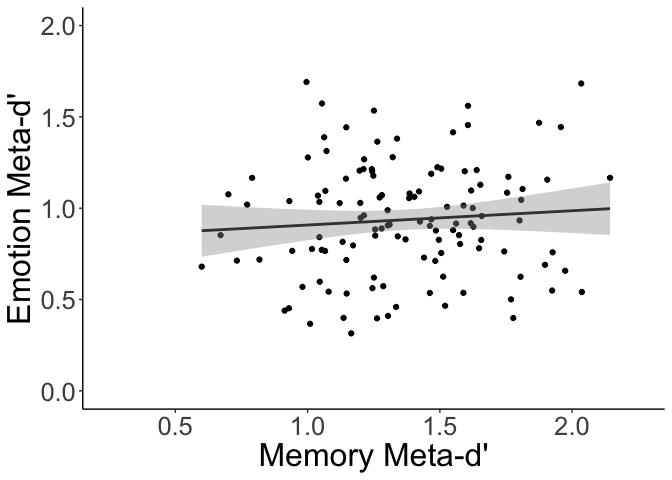
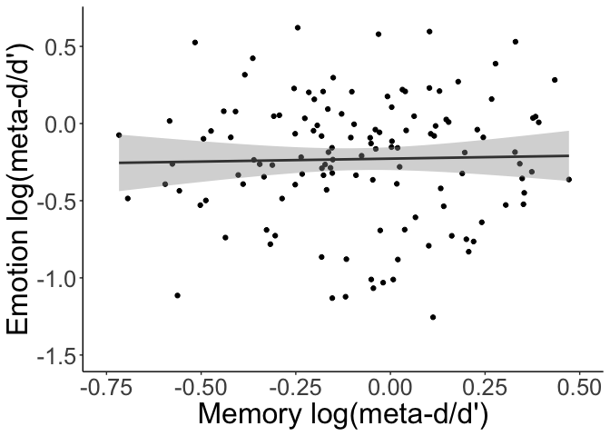

metacog\_02\_analysis

Clayton

12/30/2021

timestamp for knit

``` r
Sys.time()
```

    ## [1] "2022-01-17 20:50:34 PST"

Set up directories and load required packages.

Note-you will need to install JAGS to get Fleming’s code to work. It’s
required for rjags package
[JAGS](https://sourceforge.net/projects/mcmc-jags/)

``` r
# setup datafolder target
if (Sys.info()["sysname"] == "Windows"){
  repofolder <- paste("C:/Users/", Sys.getenv("USERNAME"), "/decisionlab/AgingCog/analysis/Metacog", 
                      sep = "")
  datafolder <- "R:/groups/chiong/aging-and-cognition/tasks/metacog/data"
  rdrivepath <- "R:/"
} else if (Sys.info()["sysname"] == "Darwin"){ # not sure why MacOS is "Darwin" but it is...
  repofolder <- "~/decisionlab/AgingCog/analysis/Metacog"
  datafolder <- "/Volumes/macdata/groups/chiong/aging-and-cognition/tasks/metacog/data/"
  rdrivepath <- "/Volumes/macdata/"
} # probably good to add another condition for Unix, later on...

library(knitr) # knitr is part of R Markdown
library(tidyverse)
library(readxl) # readxl is part of tidyverse, but is not "core tidyverse"
library(openxlsx)
library(lubridate)
knitr::opts_chunk$set(echo = TRUE)
knitr::opts_knit$set(root.dir = datafolder)

# comment out (see root.dir above): setwd(datafolder)
```

Read in emo\_mem\_df and hillblom dataset containing bsexzscore

``` r
#functino used for getting z scores
z_scores=function(data){(abs(data-mean(data))/sd(data))}

#mean centering funciton
center_scale <- function(x) {
    scale(x, scale = FALSE)}

#creating z scores to filter out those outside of two sds
#filtering d', meta-s', m-ratios, and log(m-ratio) scores outside of two sds
corr_df=read_rds('emo_mem_df.rds')%>%
  select('ExternalReference','emometad','emodprime', 
  'emofirst','memmetad','memdprime','emoMratio',
  'memMratio')%>%
  drop_na()%>%
  mutate(emometad_z=z_scores(emometad),
         memmetad_z=z_scores(memmetad),
         emodprime_z=z_scores(emodprime),
         memdprime_z=z_scores(memdprime),
         emoMratio_z=z_scores(emoMratio),
         memMratio_z=z_scores(memMratio),
         memlogMratio=log(memMratio),
         emologMratio=log(emoMratio))%>%
  drop_na()%>%
  filter((emoMratio_z<2)&
         (memMratio_z<2)&
         (z_scores(emologMratio)<2)&
         (z_scores(memlogMratio)<2))

hillblom=read_csv("/Volumes/macdata/groups/chiong/aging-and-cognition/expansive-dataset/HBSpring2020_2020-06-18.csv")

#filtering out data without bsexzscores 
hillblom=hillblom%>%
  filter(!is.na(bsexzscore))%>%
    mutate('mcage_scaled'= center_scale(age)/10,
           'mceduc'= center_scale(educ),
           'link_date' = as_date(link_date,format = "%m/%d/%y"))

hillblom=aggregate(hillblom, by=list(hillblom$PIDN), FUN=last)
```

``` r
# MRatios
corr_df%>%
  ggplot(aes(y=emoMratio, x=memMratio))+
  #theme_classic get rid of background grid
  #theme_light()+
  theme_classic()+
  theme(panel.border = element_blank()) + 
  theme(axis.line = element_line())+
  theme(text = element_text(size=24))+
  geom_point()+
  geom_smooth(method = "lm", se = TRUE, color = "grey25", formula = y~x)+
  #scale_colour_gradient(name = "Age", low = "#7bccc4", high = "#084081")+
  #don't need color gradient for age
  scale_x_continuous(name="Memory M-ratio", limits=c(0.4,1.65))+
  scale_y_continuous(name="Emotion M-ratio", limits=c(0.25,1.75))
```

<!-- -->

``` r
  #ggsave("m_ratios.eps", device=cairo_ps, fallback_resolution = 1200)

corr_df%>%
  ggplot(aes(y=emometad, memmetad))+
  #theme_classic get rid of background grid
  #theme_light()+
  theme_classic()+
  theme(panel.border = element_blank()) + 
  theme(axis.line = element_line())+
  theme(text = element_text(size=24))+
  geom_point()+
  geom_smooth(method = "lm", se = TRUE, color = "grey25", formula = y~x)+
  #scale_colour_gradient(name = "Age", low = "#7bccc4", high = "#084081")+
  #don't need color gradient for age
  ylab("Emotion Meta-d'")+
  xlab("Memory Meta-d'")+
  xlim(0.25,2.25)+
  ylim(0,2)+
  expand_limits(x = c(-2, 2))
```

<!-- -->

## Filtered only log(m-ratio) falling outside of two sds

``` r
corr_df=read_rds('emo_mem_df.rds')%>%
  select('ExternalReference',
  'emofirst','emoMratio',
  'memMratio')%>%
  mutate('memlogMratio'=log(memMratio),
         'emologMratio'=log(emoMratio))%>%
  drop_na()%>%
  filter((z_scores(emologMratio)<2)&
         (z_scores(memlogMratio)<2))

corr_df%>%
  ggplot(aes(y=emologMratio, x=memlogMratio))+
  #theme_classic get rid of background grid
  #theme_light()+
  theme_classic()+
  theme(panel.border = element_blank()) + 
  theme(axis.line = element_line())+
  theme(text = element_text(size=24))+
  geom_point()+
  geom_smooth(method = "lm", se = TRUE, color = "grey25", formula = y~x)+
  #scale_colour_gradient(name = "Age", low = "#7bccc4", high = "#084081")+
  #don't need color gradient for age
  #ylab("Emotion log(meta-d/d')")+
  #xlab("Memory log(meta-d/d')")+
  scale_y_continuous(name="Emotion log(meta-d/d')", limits=c(-1.5,.65))+
  scale_x_continuous(name="Memory log(meta-d/d')", limits=c(-0.75,.5))+
  expand_limits(x=1,y=.5)
```

<!-- -->

# Hypothesis 1

To test the association between memory metacognition and emotion
recognition metacognition efficiency using log(meta-d’/d’), we will
conduct a Pearson bivariate correlation; our concern in this hypothesis
is not explanatory but instead whether these two measures represent a
unified construct regardless of common causes.

``` r
#without removing outliers
outliers_df=read_rds('emo_mem_df.rds')%>%
  select('ExternalReference', 
  'emofirst','emoMratio',
  'memMratio')%>%
  mutate(memlogMratio=log(memMratio),
         emologMratio=log(emoMratio))%>%
  drop_na()

print(cor.test(outliers_df$emologMratio,outliers_df$memlogMratio))
```

    ## 
    ##  Pearson's product-moment correlation
    ## 
    ## data:  outliers_df$emologMratio and outliers_df$memlogMratio
    ## t = 0.37242, df = 139, p-value = 0.7101
    ## alternative hypothesis: true correlation is not equal to 0
    ## 95 percent confidence interval:
    ##  -0.1344411  0.1958626
    ## sample estimates:
    ##        cor 
    ## 0.03157278

``` r
#with removing outliers
print(cor.test(corr_df$emologMratio,corr_df$memlogMratio))
```

    ## 
    ##  Pearson's product-moment correlation
    ## 
    ## data:  corr_df$emologMratio and corr_df$memlogMratio
    ## t = 0.28296, df = 125, p-value = 0.7777
    ## alternative hypothesis: true correlation is not equal to 0
    ## 95 percent confidence interval:
    ##  -0.1495733  0.1986397
    ## sample estimates:
    ##        cor 
    ## 0.02530062

For our second analysis looking at the relationship between emotion
recognition metacognitive efficiency and executive functioning, we will
conduct a multiple regression with log(meta-d’/d’) for the emotion
recognition task as the outcome variable and executive function
composite score, age, education, and gender as predictors. Our third
analysis will be identical to our second, only with memory metacognitive
efficiency as the outcome variable. Participants falling outside of two
standard deviations on any measure of interest will be excluded from
analysis. However, we will reinclude those data for a sensitivity
analysis following our initial analysis to assess whether outlier
removal alters reported findings.

## emotion recognition efficiency regression

``` r
#use this for both emo and m em regressions
bsexz_df=hillblom%>%
  mutate(ExternalReference=as.character(PIDN))%>%
  select(ExternalReference,bsexzscore, link_date)#%>%
#not filtering outliers for bsexzscore
  #filter(bsexzscore<2)


#read back in df 
emo_df=read_rds('emo_mem_df.rds')%>%
  select('ExternalReference','emoMratio',
         'age','Educ','Gender','emofirst','RecordedDate')%>%
  mutate('emologMratio'=log(emoMratio),
          'PIDN' = ExternalReference,
         'Date' = RecordedDate)%>%
  drop_na()%>%
  filter(z_scores(emologMratio)<2)
emo_df=left_join(emo_df,bsexz_df,by='ExternalReference')%>%
  drop_na()%>%
  mutate('mcage_scaled'= as.numeric(center_scale(age)/10),
         'mceduc'= as.numeric(center_scale(Educ)),
         'ex_gap'=as.period(interval(start = as_date(link_date), 
                                     end = as_date(RecordedDate)))$year)%>%
  filter(ex_gap<4)
  

# memory metacognition pred by bsexz controlling for age, educ, and gender
summary(lm(emologMratio ~ bsexzscore + mcage_scaled + mceduc + factor(Gender) + factor(emofirst), data = emo_df))
```

    ## 
    ## Call:
    ## lm(formula = emologMratio ~ bsexzscore + mcage_scaled + mceduc + 
    ##     factor(Gender) + factor(emofirst), data = emo_df)
    ## 
    ## Residuals:
    ##      Min       1Q   Median       3Q      Max 
    ## -0.99778 -0.23965  0.02702  0.25802  1.01929 
    ## 
    ## Coefficients:
    ##                   Estimate Std. Error t value Pr(>|t|)    
    ## (Intercept)       -0.29597    0.06239  -4.744 5.37e-06 ***
    ## bsexzscore         0.10010    0.05963   1.679   0.0956 .  
    ## mcage_scaled       0.01068    0.04435   0.241   0.8101    
    ## mceduc             0.01225    0.01795   0.682   0.4963    
    ## factor(Gender)2    0.01980    0.07199   0.275   0.7838    
    ## factor(emofirst)0  0.02224    0.07084   0.314   0.7541    
    ## ---
    ## Signif. codes:  0 '***' 0.001 '**' 0.01 '*' 0.05 '.' 0.1 ' ' 1
    ## 
    ## Residual standard error: 0.3976 on 132 degrees of freedom
    ## Multiple R-squared:  0.02716,    Adjusted R-squared:  -0.009694 
    ## F-statistic: 0.7369 on 5 and 132 DF,  p-value: 0.597

``` r
#control for time from exec fxn score and metacog task completion
summary(lm(emologMratio ~ bsexzscore + mcage_scaled + mceduc + factor(Gender) + factor(emofirst) + ex_gap, data = emo_df))
```

    ## 
    ## Call:
    ## lm(formula = emologMratio ~ bsexzscore + mcage_scaled + mceduc + 
    ##     factor(Gender) + factor(emofirst) + ex_gap, data = emo_df)
    ## 
    ## Residuals:
    ##      Min       1Q   Median       3Q      Max 
    ## -0.99836 -0.23952  0.03307  0.25840  1.03375 
    ## 
    ## Coefficients:
    ##                    Estimate Std. Error t value Pr(>|t|)  
    ## (Intercept)       -0.247880   0.127352  -1.946   0.0537 .
    ## bsexzscore         0.097436   0.060128   1.620   0.1075  
    ## mcage_scaled       0.008114   0.044873   0.181   0.8568  
    ## mceduc             0.012586   0.018023   0.698   0.4862  
    ## factor(Gender)2    0.023065   0.072610   0.318   0.7513  
    ## factor(emofirst)0  0.021655   0.071074   0.305   0.7611  
    ## ex_gap            -0.021749   0.050163  -0.434   0.6653  
    ## ---
    ## Signif. codes:  0 '***' 0.001 '**' 0.01 '*' 0.05 '.' 0.1 ' ' 1
    ## 
    ## Residual standard error: 0.3988 on 131 degrees of freedom
    ## Multiple R-squared:  0.02855,    Adjusted R-squared:  -0.01594 
    ## F-statistic: 0.6417 on 6 and 131 DF,  p-value: 0.6967

``` r
#ggplot(emo_df, aes(x=emologMratio)) + geom_histogram(bins=10)
```

# checking if kept outliers

``` r
emo_outliers_df=read_rds('emo_mem_df.rds')%>%
  select('ExternalReference','emoMratio',
         'age','Educ','Gender','emofirst','RecordedDate')%>%
  mutate('emologMratio'=log(emoMratio),
          'PIDN' = ExternalReference,
         'Date' = RecordedDate)%>%
  drop_na()

emo_outliers_df=left_join(emo_outliers_df,bsexz_df,by='ExternalReference')%>%
  drop_na()%>%
  mutate('mcage_scaled'= as.numeric(center_scale(age)/10),
         'mceduc'= as.numeric(center_scale(Educ)),
         'ex_gap'=as.period(interval(start = as_date(link_date), 
                                     end = as_date(RecordedDate)))$year)%>%
  filter(ex_gap<4)
#outlier model
summary(lm(emologMratio ~ bsexzscore + mcage_scaled + mceduc + factor(Gender) + factor(emofirst), data = emo_outliers_df))
```

    ## 
    ## Call:
    ## lm(formula = emologMratio ~ bsexzscore + mcage_scaled + mceduc + 
    ##     factor(Gender) + factor(emofirst), data = emo_outliers_df)
    ## 
    ## Residuals:
    ##     Min      1Q  Median      3Q     Max 
    ## -1.3885 -0.2705  0.0693  0.3055  1.0284 
    ## 
    ## Coefficients:
    ##                    Estimate Std. Error t value Pr(>|t|)    
    ## (Intercept)       -0.353919   0.076087  -4.652 7.51e-06 ***
    ## bsexzscore         0.085032   0.069231   1.228    0.221    
    ## mcage_scaled       0.005207   0.054072   0.096    0.923    
    ## mceduc             0.019875   0.021408   0.928    0.355    
    ## factor(Gender)2   -0.047166   0.087206  -0.541    0.589    
    ## factor(emofirst)0  0.118759   0.085680   1.386    0.168    
    ## ---
    ## Signif. codes:  0 '***' 0.001 '**' 0.01 '*' 0.05 '.' 0.1 ' ' 1
    ## 
    ## Residual standard error: 0.4952 on 141 degrees of freedom
    ## Multiple R-squared:  0.03418,    Adjusted R-squared:  -7.287e-05 
    ## F-statistic: 0.9979 on 5 and 141 DF,  p-value: 0.4214

``` r
#control for time from exec fxn score and metacog task completion
summary(lm(emologMratio ~ bsexzscore + mcage_scaled + mceduc + factor(Gender) + factor(emofirst) + ex_gap, data = emo_outliers_df))
```

    ## 
    ## Call:
    ## lm(formula = emologMratio ~ bsexzscore + mcage_scaled + mceduc + 
    ##     factor(Gender) + factor(emofirst) + ex_gap, data = emo_outliers_df)
    ## 
    ## Residuals:
    ##      Min       1Q   Median       3Q      Max 
    ## -1.40058 -0.25297  0.06822  0.31818  1.02175 
    ## 
    ## Coefficients:
    ##                     Estimate Std. Error t value Pr(>|t|)  
    ## (Intercept)       -0.2713415  0.1531419  -1.772   0.0786 .
    ## bsexzscore         0.0798422  0.0698823   1.143   0.2552  
    ## mcage_scaled       0.0008954  0.0546317   0.016   0.9869  
    ## mceduc             0.0207993  0.0215059   0.967   0.3351  
    ## factor(Gender)2   -0.0415535  0.0878617  -0.473   0.6370  
    ## factor(emofirst)0  0.1179385  0.0858771   1.373   0.1718  
    ## ex_gap            -0.0374617  0.0602486  -0.622   0.5351  
    ## ---
    ## Signif. codes:  0 '***' 0.001 '**' 0.01 '*' 0.05 '.' 0.1 ' ' 1
    ## 
    ## Residual standard error: 0.4963 on 140 degrees of freedom
    ## Multiple R-squared:  0.03684,    Adjusted R-squared:  -0.004442 
    ## F-statistic: 0.8924 on 6 and 140 DF,  p-value: 0.5024

## memory recognition efficiency regression

``` r
#read back in df 
mem_df=read_rds('emo_mem_df.rds')%>%
  select('ExternalReference','memMratio',
         'age','Educ','Gender','emofirst',
         'RecordedDate')%>%
  mutate('memlogMratio'=log(memMratio),
         'PIDN' = ExternalReference,
         'Date' = RecordedDate)%>%
  drop_na()%>%
  filter(z_scores(memlogMratio)<2)

mem_df=left_join(mem_df,bsexz_df,by='ExternalReference')%>%
  drop_na()%>%
  mutate('mcage_scaled'= as.numeric(center_scale(age)/10),
         'mceduc'= as.numeric(center_scale(Educ)),
         'ex_gap'=as.period(interval(start = as_date(link_date), 
                                     end = as_date(RecordedDate)))$year)%>%
  filter(ex_gap<4)
  


# memory metacognition pred by bsexz controlling for age, educ, and gender
summary(lm(memlogMratio ~ bsexzscore + mcage_scaled + mceduc + factor(Gender) + factor(emofirst), data = mem_df))
```

    ## 
    ## Call:
    ## lm(formula = memlogMratio ~ bsexzscore + mcage_scaled + mceduc + 
    ##     factor(Gender) + factor(emofirst), data = mem_df)
    ## 
    ## Residuals:
    ##      Min       1Q   Median       3Q      Max 
    ## -0.65476 -0.16127  0.02147  0.20265  0.50881 
    ## 
    ## Coefficients:
    ##                   Estimate Std. Error t value Pr(>|t|)   
    ## (Intercept)       -0.14864    0.04938  -3.010  0.00324 **
    ## bsexzscore         0.05508    0.04046   1.361  0.17626   
    ## mcage_scaled       0.06826    0.03536   1.931  0.05610 . 
    ## mceduc             0.01072    0.01225   0.875  0.38350   
    ## factor(Gender)2    0.04956    0.05193   0.954  0.34204   
    ## factor(emofirst)0  0.02506    0.05008   0.500  0.61785   
    ## ---
    ## Signif. codes:  0 '***' 0.001 '**' 0.01 '*' 0.05 '.' 0.1 ' ' 1
    ## 
    ## Residual standard error: 0.2652 on 110 degrees of freedom
    ## Multiple R-squared:  0.04855,    Adjusted R-squared:  0.005298 
    ## F-statistic: 1.123 on 5 and 110 DF,  p-value: 0.3527

``` r
#control for time from exec fxn score and metacog task completion
summary(lm(memlogMratio ~ bsexzscore + mcage_scaled + mceduc + factor(Gender) + factor(emofirst) + ex_gap, data = mem_df))
```

    ## 
    ## Call:
    ## lm(formula = memlogMratio ~ bsexzscore + mcage_scaled + mceduc + 
    ##     factor(Gender) + factor(emofirst) + ex_gap, data = mem_df)
    ## 
    ## Residuals:
    ##      Min       1Q   Median       3Q      Max 
    ## -0.64366 -0.17023  0.01115  0.19102  0.48592 
    ## 
    ## Coefficients:
    ##                   Estimate Std. Error t value Pr(>|t|)  
    ## (Intercept)       -0.24764    0.09877  -2.507   0.0136 *
    ## bsexzscore         0.06110    0.04074   1.500   0.1365  
    ## mcage_scaled       0.07554    0.03586   2.107   0.0374 *
    ## mceduc             0.00891    0.01233   0.723   0.4713  
    ## factor(Gender)2    0.04328    0.05214   0.830   0.4082  
    ## factor(emofirst)0  0.02946    0.05015   0.587   0.5581  
    ## ex_gap             0.04372    0.03780   1.157   0.2499  
    ## ---
    ## Signif. codes:  0 '***' 0.001 '**' 0.01 '*' 0.05 '.' 0.1 ' ' 1
    ## 
    ## Residual standard error: 0.2648 on 109 degrees of freedom
    ## Multiple R-squared:  0.06008,    Adjusted R-squared:  0.008346 
    ## F-statistic: 1.161 on 6 and 109 DF,  p-value: 0.3324

``` r
#ggplot(emo_df, aes(x=emologMratio)) + geom_histogram(bins=10)
```

# checking if kept outliers

``` r
mem_outliers_df=read_rds('emo_mem_df.rds')%>%
  select('ExternalReference','memMratio',
         'age','Educ','Gender','emofirst',
         'RecordedDate')%>%
  mutate('memlogMratio'=log(memMratio),
         'PIDN' = ExternalReference,
         'Date' = RecordedDate)%>%
  drop_na()

mem_outliers_df=left_join(mem_outliers_df,bsexz_df,by='ExternalReference')%>%
  drop_na()%>%
  mutate('mcage_scaled'= as.numeric(center_scale(age)/10),
         'mceduc'= as.numeric(center_scale(Educ)),
         'ex_gap'=as.period(interval(start = as_date(link_date), 
                                     end = as_date(RecordedDate)))$year)%>%
  filter(ex_gap<4)

summary(lm(memlogMratio ~ bsexzscore + mcage_scaled + mceduc + factor(Gender) + factor(emofirst), data = mem_outliers_df)) 
```

    ## 
    ## Call:
    ## lm(formula = memlogMratio ~ bsexzscore + mcage_scaled + mceduc + 
    ##     factor(Gender) + factor(emofirst), data = mem_outliers_df)
    ## 
    ## Residuals:
    ##      Min       1Q   Median       3Q      Max 
    ## -1.02323 -0.17376  0.02102  0.22596  0.71664 
    ## 
    ## Coefficients:
    ##                    Estimate Std. Error t value Pr(>|t|)  
    ## (Intercept)       -0.134609   0.057166  -2.355   0.0202 *
    ## bsexzscore         0.056573   0.047998   1.179   0.2409  
    ## mcage_scaled       0.049535   0.041340   1.198   0.2332  
    ## mceduc             0.005707   0.014613   0.391   0.6968  
    ## factor(Gender)2    0.025971   0.061027   0.426   0.6712  
    ## factor(emofirst)0 -0.021731   0.058567  -0.371   0.7113  
    ## ---
    ## Signif. codes:  0 '***' 0.001 '**' 0.01 '*' 0.05 '.' 0.1 ' ' 1
    ## 
    ## Residual standard error: 0.3209 on 117 degrees of freedom
    ## Multiple R-squared:  0.02335,    Adjusted R-squared:  -0.01839 
    ## F-statistic: 0.5594 on 5 and 117 DF,  p-value: 0.7309

``` r
#control for time from exec fxn score and metacog task completion
summary(lm(memlogMratio ~ bsexzscore + mcage_scaled + mceduc + factor(Gender) + factor(emofirst) + ex_gap, data = mem_outliers_df))
```

    ## 
    ## Call:
    ## lm(formula = memlogMratio ~ bsexzscore + mcage_scaled + mceduc + 
    ##     factor(Gender) + factor(emofirst) + ex_gap, data = mem_outliers_df)
    ## 
    ## Residuals:
    ##      Min       1Q   Median       3Q      Max 
    ## -1.01242 -0.18510  0.02375  0.20643  0.74123 
    ## 
    ## Coefficients:
    ##                    Estimate Std. Error t value Pr(>|t|)  
    ## (Intercept)       -0.249919   0.116746  -2.141   0.0344 *
    ## bsexzscore         0.065051   0.048521   1.341   0.1826  
    ## mcage_scaled       0.057310   0.041857   1.369   0.1736  
    ## mceduc             0.003695   0.014703   0.251   0.8020  
    ## factor(Gender)2    0.017533   0.061407   0.286   0.7758  
    ## factor(emofirst)0 -0.013860   0.058908  -0.235   0.8144  
    ## ex_gap             0.050429   0.044534   1.132   0.2598  
    ## ---
    ## Signif. codes:  0 '***' 0.001 '**' 0.01 '*' 0.05 '.' 0.1 ' ' 1
    ## 
    ## Residual standard error: 0.3205 on 116 degrees of freedom
    ## Multiple R-squared:  0.03402,    Adjusted R-squared:  -0.01594 
    ## F-statistic: 0.681 on 6 and 116 DF,  p-value: 0.6653

``` r
#save to excel files for VBM
emo_df=emo_df%>%
  select(PIDN, Date, mceduc,emologMratio)

mem_df=mem_df%>%
  select(PIDN,Date,mceduc, memlogMratio)


#write.xlsx(emo_df,'emo_df.xlsx', overwrite = FALSE)
#write.xlsx(mem_df,'mem_df.xlsx', overwrite = FALSE)
```
