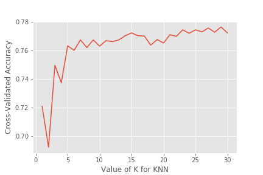
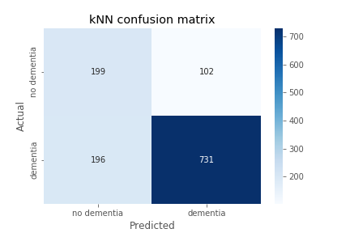

Here I used cross validation to find the best number of neighbors to use for the model, which turns out to be 27. I'm predicting the binary outcome of whether or not someone has dementia as measured by a clinical dementia rating of .5+. I'm using [(MMSE)](http://www.fammed.usouthal.edu/Guides&JobAids/Geriatric/MMSE.pdf) neuropsych data as well as the patient participant's age, gender, and handedness for my features of interest (33 features total).

Here I have the confusion matrix from my knn model. We see the model has 731 true positives, 196 false negatives, 199 true negatives, 102 false positives. This give us:
Logloss: 0.44 
f1: 0.83
Precision: 0.8776
Recall: 0.7886
ROC AUC score: 0.8269540223705949
